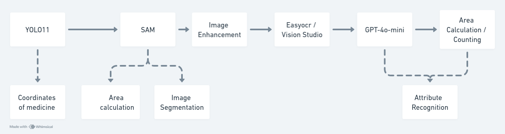

# RackIQ

This project implements a workflow for detecting medicine strips in images, extracting text using Optical Character Recognition (OCR), and post-processing the extracted text to generate a meaningful structured dictionary of the medicine's details, tablet counting.

For clarity in detail please refer to assets/RackIQ.pdf

## Workflow

1. **Input**: An image containing one or multiple medicine strips.
2. **YOLO Detection**: The image is passed through a YOLO (You Only Look Once) model to calculate the number of strips in the image.
3. **Segmentation with SAM**: The Segment Anything Model (SAM) is used to segment the detected strips.
4. **OCR and Text Extraction**: The segmented strip is rotated in four orientations, and Microsoft Azure vision studio is used to extract text from all orientations. The extracted text is combined.
5. **Post-processing with GPT-4o Mini**: The combined text is processed by GPT-4o Mini to generate a structured dictionary containing details such as the medicine name, composition, manufacturing date, expiry date, etc.
6. **Tablet Count Calculation**: A coin-based approach is used to calculate the area of the strip, which helps determine the number of tablets in the strip. This information is updated in the dictionary.
7. **Final Output**: The output includes the medicine name, details, and the number of tablets.
 
## Functionality

This project automates the process of detecting medicine strips, extracting text, and organizing the data into a structured format. It is particularly useful for inventory management and reducing human error in medical stores by identifying the medicine, its details, and calculating the number of tablets.

## Components

### 1. YOLO Detection (`src/components/yolo.py`)

The `StripCount()` class is designed to detect and count medicine strips in an image using the YOLO object detection model. The class loads a YOLO model, processes the input image, and counts the number of detected strips based on a confidence threshold.

Attributes:
-model_weights_path (str): The file path to the YOLO model weights. It defaults to `"./artifacts/yolo/yolo.pt"`.
-model (YOLO): A YOLO model object initialized with the specified model weights.
-confidence_threshold (float,optional): The confidence threshold for strip detection. Only detected objects with confidence scores higher than this threshold are considered.
the default is 0.75
`calculate_strip_count(self, image)`: Counts the number of strips in the provided image based on object detection results.

Parameters:
image (str or np.ndarray): The path to the image file or a loaded image in the form of a NumPy array.
Returns:
count (int): The number of strips detected in the image that exceed the confidence threshold.
Raises:
ValueError: Raised if the image format is neither a string (image path) nor a NumPy array.

### 2. Segmentation with SAM (`src/components/sam.py`)

The Segment Anything Model (SAM) component is responsible for generating segmentation masks for objects in an image. This component utilizes the Vision Transformer (ViT) model to perform classification of  medicine strips or other irrelevant regions from the input image.

Attributes:

`CHECKPOINT_PATH (str)`: The file path to the pre-trained SAM model weights, located in the `./artifacts/sam directory.`
sam: The SAM model initialized with the specified checkpoint and loaded onto the defined device.
mask_generator: The mask generator object, which uses the SAM model to create segmentation masks.
`inference(self, image_path: str = None, image = None)`:Performs segmentation on the provided image and returns the generated segmentation masks.

Parameters:

image_path (str, optional): Path to the input image file. If provided, the image is loaded using OpenCV and converted to RGB format.
image (np.ndarray or PIL.Image.Image, optional): Alternatively, an image can be provided directly as a NumPy array or a PIL Image. If provided, it is converted to the required RGB format.
Either image_path or image must be provided for the inference process.

Returns:

sam_result (dict): The segmentation result containing the generated masks. Each mask includes details like the segmented area, bounding box, etc.


### 3. Text Post-processing with GPT-4o Mini (`src/components/gpt.py`)

The GPT component is responsible for post-processing the text extracted by EasyOCR from medicine strips at different orientations. After the OCR text extraction, GPT is used to generate a structured response in JSON format, detailing information such as the medicine name, ingredients, expiry date, and other relevant details.

This step is crucial in the pipeline as it organizes and interprets the raw OCR output into meaningful and structured information, reducing the chance of human error in medicine inventory management.

Attributes:
`client (OpenAI)`: The OpenAI API client, initialized with an API key loaded from environment variables using dotenv..

`prompt (str)`: The prompt in `get_prompt()` consists of a system message that provides the GPT model with the possible medicine names (from the Tablet_Config.csv) and a predefined instruction loaded from prompt.txt. This ensures GPT receives context about the medicine names and how to return a structured JSON response.

`inference(self, question)`:Processes the OCR output from the medicine strip image through GPT and returns a structured JSON response containing relevant medicine details.

Parameters:
question (str): The OCR output text from the medicine strip image, which GPT will process to extract structured information.
Returns:
response.choices[0].message.content.strip() (str): A structured response in JSON format containing key details such as medicine name, ingredients, expiry date, and manufacturing date.


### 4. Infernece class (`src/pipeline/textract_inference.py`)

`Inference()`:Initializes an instance of the Inference class, which loads the necessary models (YOLO, SAM, EasyOCR, GPT) for the inference pipeline.
### Methods:

- **Usage**:
  ```python
  inference_pipeline = Inference()
  ```

# `inference(self, image_path: str = None, image: Image = None)`
Performs the entire pipeline to extract text from medicine strips and count the number of tablets. The method works either with an image file path or a pre-loaded image.

- **Parameters**:
  - `image_path` (`str`): The file path to the image of the medicine strips.
  - `image` (`PIL.Image`): A pre-loaded image of the medicine strips.
  
- **Returns**:
  - `result` (`dict`): A dictionary containing the structured information extracted from the medicine strips. This includes medicine name, count, and additional details like area and tablet composition.


### Attributes:
- **sam** (`SAM`): The Segment Anything Model (SAM) that segments the image into different regions, including medicine strips.
- **gpt** (`GPT`): The GPT model responsible for post-processing the OCR-extracted text to produce structured information in JSON format.
- **yolo** (`StripCount`): A YOLO-based model that estimates the number of medicine strips in the image.
- **ocr** (`easyocr.Reader`): An EasyOCR reader instance for performing text extraction from the cropped images of the strips.
- **num_maps** (`int`): The number of expected strip segmentations, determined from YOLO.
- **dist_min** (`float`): Minimum distance used to select the best segmentation area.
- **area_min** (`float`): Minimum area to calculate the scale factor for estimating tablet count.
- **circle_area_thresh** (`int`): Threshold for filtering out regions that are too large to be strips (e.g., large circular areas).
- **strip_area_thresh** (`int`): Threshold for identifying the relevant areas as strips.
- **scale_factor** (`float`): Scale factor calculated from the reference area for estimating the number of tablets.
- **area_real** (`float`): The real-world area (in cm²) used to calculate the scale factor for estimating the number of tablets.
- **strip_config** (`pd.DataFrame`): Configuration of the medicines, including their area and total tablet count, loaded from a CSV file.
- **result** (`dict`): A dictionary that stores the final structured result of the inference, including medicine name, area, and count.
- **count_threshold** (`float`): Threshold for the allowed variation in tablet count estimation, set to 10% of the total count.


- **Workflow**:
  1. **Segmenting the Image (SAM)**: 
     - SAM segments the image into multiple regions, including the medicine strips.
     - Each segmented area is evaluated based on its size and distance from the mask center.
     
  2. **Estimating the Number of Strips (YOLO)**:
     - YOLO estimates the total number of strips in the image. This helps determine how many regions to process.
     
  3. **Calculating Scale Factor**:
     - The area of the smallest valid region is used to calculate a scale factor, which will later be used for estimating the number of tablets in a strip.
     
  4. **OCR Text Extraction**:
     - For each valid strip, text is extracted using EasyOCR from multiple orientations (original and rotated by 270 degrees). This ensures that text is captured regardless of the strip's orientation.
     
  5. **GPT Post-Processing**:
     - The extracted OCR text is passed to GPT for further processing. GPT returns a structured JSON response containing details like the medicine name, ingredients, and expiry date.
     
  6. **Tablet Counting**:
     - The area of each strip is calculated, and the number of tablets is estimated based on the medicine's configuration (loaded from the `Tablet_Config.csv` file). The estimated count is adjusted by the scale factor.
     
  7. **Storing Results**:
     - The structured information for each medicine (including its name, count, and area) is stored in the `result` dictionary. If the medicine name is already present in the results, the count is updated.

  8. **Logging**:
     - The total time taken for the pipeline is logged for performance tracking.


### Key Components in the Pipeline:
1. **SAM (Segment Anything Model)**: Segments the image to identify potential strips.
2. **YOLO (Strip Count)**: Estimates the number of strips in the image to guide further segmentation.
3. **EasyOCR/ Microsoft Vision studio**: Extracts text from valid strips.
4. **GPT**: Processes OCR text and returns structured medicine details.
5. **Tablet Counting**: Calculates the number of tablets in each strip based on scale factor and configuration data.

### Notes:
- The medicine configuration file (`Tablet_Config.csv`) must contain information about the tablet's area and total count for accurate tablet counting.
- The EasyOCR model processes the strip from multiple orientations to ensure text is captured regardless of rotation.
- The GPT model refines the OCR output, returning structured data in JSON format.


### 7. Main Script (`main.py`)
This script serves as the main entry point for testing the Inference pipeline, which processes images of medicine strips to extract information such as medicine names and tablet counts. It logs the results into a text file for review.

Script Overview
The script imports necessary modules and initializes the inference pipeline.
It defines a function to test inference on a single image and iterates over multiple images, writing the results to a text file.
Key Components
Imports: `from src/pipeline/inference import Inference`
Inference: Imports the Inference class, which contains methods for processing images and extracting details about medicine strips.
Image: Imports the Image module from the PIL (Python Imaging Library) for opening and manipulating image files.

`Inference()`:Initializes an instance of the Inference class, which loads the necessary models (YOLO, SAM, ViT, EasyOCR, GPT) for the inference pipeline.
test_inference Function:
- **Usage**:
  ```python
  result = inference_pipeline.inference(image_path="path/to/medicine_strip_image.jpg")
  print(result)
  ```

Parameters:
image_path (str): The file path of the image to be processed. Defaults to `./assets/img_006.jpg`.
Returns:
result (dict): A dictionary containing details about the extracted medicine information.
Functionality:
Opens the specified image using PIL and calls the inference method on the image.
Returns the result of the inference as a dictionary.

Functionality:
The script runs when executed as the main program.
Opens a file named results.txt for writing results.
Iterates through a range of image paths (from img_000.jpg to img_009.jpg).
For each image, it calls the test_inference function and writes the results to results.txt.
Each entry includes the image name and the extracted medicine details.
The results are formatted and separated by lines for clarity.
Commented Code:
python main.py
After execution, check the results.txt file for the extracted information.
Output:
The output is written to results.txt, containing the medicine names and their associated details extracted from the images processed through the inference pipeline. Each entry is clearly separated for easy reading.


## Usage

1. Ensure all required libraries are installed (ultralytics, opencv-python, easyocr, GPT-4).
2. Place your YOLO model file in the appropriate directory.
3. Run the `main.py` script, providing the paths to your model and input image.

## Libraries Used

The following libraries are used in this project:

- easyocr==1.7.1
- Flask==3.0.3
- numpy==2.1.1
- openai==1.50.2
- opencv_contrib_python==4.10.0.84
- opencv_python==4.10.0.84
- opencv_python_headless==4.10.0.84
- pandas==2.2.3
- Pillow==10.4.0
- python-dotenv==1.0.1
- segment_anything==1.0
- streamlit==1.38.0
- torch==2.2.2
- torchvision==0.17.2
- ultralytics==8.2.100

Please ensure these libraries are installed before running the project.

# Environment Variables keys

OpenAI API variables:
1. `OPENAI_API_KEY`  
2. `OPENAI_MODEL`  

Server variables:
1. `PORT` = '8080'  
2. `HOST` = '0.0.0.0'  

DMS variables:
1. `ACCESS_TOKEN_URL`  
2. `DMS_URL`  
3. `DMS_USERNAME` =  
4. `DMS_PASSWORD` =  
5. `DMS_CLIENT_ID` =  
6. `DMS_CLIENT_SECRET` =  
7. `DMS_DOC_PATH` = 'medstrips/images'  
8. `DMS_DOCUMENT_TYPE_ID` =  

MongoDB variables:
1. `MONGO_URI`  
2. `MONGO_DB_NAME` = 'packaged-drug-detection-module'  
3. `MONGO_COLLECTION_NAME` = 'request-response-data'  
4. `MONGO_METADATA_COLLECTION` = 'meta-data'  

Azure variables:
1. `AZURE_ENDPOINT`  
2. `AZURE_KEY`  
